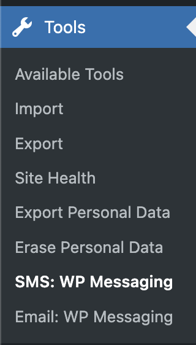
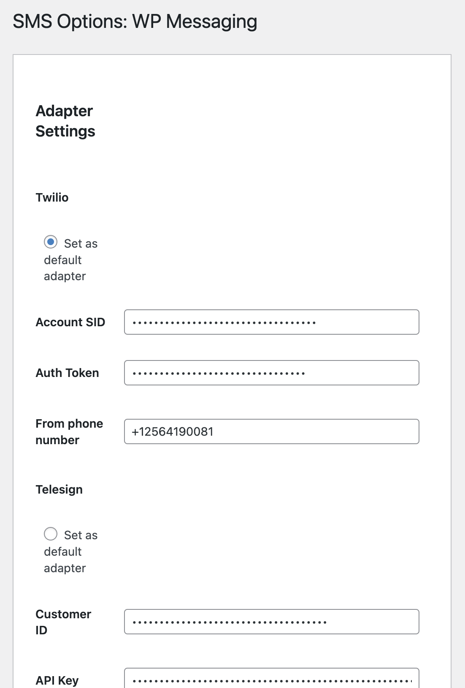
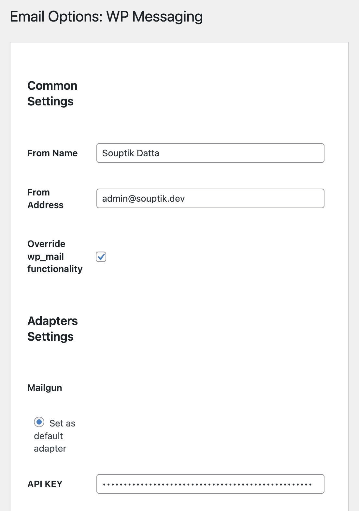
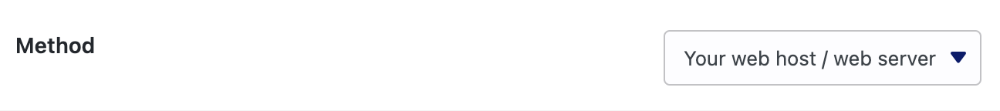
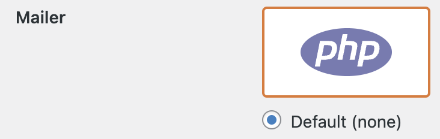

# All Path messaging


[Download the WP Plugin ♥](https://wordpress.org/plugins/all-path-messaging/)

Limitless Communication: All-in-one, super scalable, messaging Solution for WordPress.

Ok hold on! ✋. So, many words in one line.
Let's understand each one-by-one.

- **All-in-one:** What do you want? - Email, SMS, push-notification? Get all-in-one.
  - But I don't want to use `xyz` provider for SMS, I want to use `pqr`, can I have that? Yes it provides you with lot of pre implemented providers for all email, sms and push-notification.
- **Super Scalable:** But I want to use an email provider named `yxr` you haven't heard the name of. Now what? 🧐
  - No worries! Are you a developer? If yes, just write your own plugin and implement your own adapter and see it nicely hooked-up with "WordPress messaging". Please refer to [this](https://github.com/Souptik2001/wp-messaging/wiki/Create-your-own-Adapter-%F0%9F%9B%A0%EF%B8%8F) section for implementing adapters.

And that's how it provides **Limitless communication**! 🚀

## Open Source courtesy

A big thank you to these open source projects, which play a crucial role in this project!

- [Utopia Messaging](https://github.com/utopia-php/messaging) - This is literally the backbone of the project. More about it [here](https://github.com/Souptik2001/all-path-messaging?tab=readme-ov-file#special-mention-about-utopia-messaging-package-). 🔥
- [Travelopia WordPress PHPCS Coding Standards](https://github.com/Travelopia/wordpress-coding-standards-phpcs) - Super cool PHPCS coding standard rules. ✨

## Quick Links

[Setup ⚙️](https://github.com/Souptik2001/wp-messaging/wiki/Setup-%E2%9A%99%EF%B8%8F) | [Issues](https://github.com/Souptik2001/wp-messaging/issues) | [Services and functions 🧩](https://github.com/Souptik2001/wp-messaging/wiki/Services-and-functions-%F0%9F%A7%A9) | [Create your own Adapter 🛠️](https://github.com/Souptik2001/wp-messaging/wiki/Create-your-own-Adapter-%F0%9F%9B%A0%EF%B8%8F)

## WIKI

The main two ideas of the the plugin are -

#### For Developers -

- To give a simple easy to use  function to send **Email**, **SMS** or **Push Notifications** through the selected adapter.
- Don't have your desired adapter? No need to wait for me! Go ahead and add the adapter yourself, by just a simple boilerplate code! [See how easy it is to add your own adapter](https://github.com/Souptik2001/all-path-messaging?tab=readme-ov-file#creating-your-own-adapter-%EF%B8%8F)!

#### For users -

- WordPress' default `wp_mail` doesn't deliver your mail reliably? Select any of the available adapters to override `wp_mail` to deliver mails reliably.
- Already using some email marketing plugin? But not finding your desired provider? And tired of requesting the author to introduce the provider? 😣 - No worries! 🎉 - Have some developer friend, or some coding knowledge? [Learn how easy it is to add your own provider with a simple boilerplate code](https://github.com/Souptik2001/all-path-messaging?tab=readme-ov-file#creating-your-own-adapter-%EF%B8%8F)!
  - TLDR; Keep using your favorite email marketing plugin, while routing the emails through **All Path Messaging** plugin! 🚀

### Settings page ⚙️

all-path-messaging provides different settings page for each service, under the "tools" menu -



And each settings just contains list of adapters, with their required settings and a radio button to make it the default one -



The Email settings just have one extra settings, to choose whether to override the `wp_mail` function or not, using a simple checkbox! -



You are now all set to start using **All Path Messaging**! 🎉

### Services -

#### Email 📧📨

Send an email through a particular adapter (with headers 😉) -

```php
\Souptik\AllPathMessaging\Email\send(
  [ 'dev2@souptik.dev' ],
  'Yay its working!',
  'This is some long mail body.',
  'Souptik',
  'dev1@souptik.dev',
  [
   'cc' => [
    [
     'name'  => 'CC Test',
     'email' => 'cc@souptik.dev',
    ],
   ],
   'attachments' => [
    trailingslashit( WP_CONTENT_DIR ) . '/mu-plugins/test-all-path-messaging.php',
     'SameFileDifferentName.php' => trailingslashit( WP_CONTENT_DIR ) . '/mu-plugins/test-all-path-messaging.php',
   ],
  ],
  'mailgun'
 );
```

Just remove the last parameter! And now it uses the default selected adapter -

```php
\Souptik\AllPathMessaging\Email\send(
  [ 'dev2@souptik.dev' ],
  'Yay its working!',
  'This is some long mail body.',
  'Souptik',
  'dev1@souptik.dev',
  [
   'cc' => [
    [
     'name'  => 'CC Test',
     'email' => 'cc@souptik.dev',
    ],
   ],
   'attachments' => [
    trailingslashit( WP_CONTENT_DIR ) . '/mu-plugins/test-all-path-messaging.php',
     'SameFileDifferentName.php' => trailingslashit( WP_CONTENT_DIR ) . '/mu-plugins/test-all-path-messaging.php',
   ],
  ],
 );
```

Checked the override `wp_mail` checkbox? Try a simple `wp_mail`! -

```php
wp_mail(
  [ 'dev2@souptik.dev' ],
  'Yay its working!',
  'This is some long mail body - from <strong>wp_mail</strong>.',
  [],
  []
 );
```

##### Keep using your favorite email marketing/managing tool ❤️

The interesting part of this plugin is that it only focuses on solving the smallest purpose it is created for in the most efficient way possible.

For almost all the email marketing/managing tool there is an option to select how you want to send the email (if there is none, then it by default uses `wp_mail`), like these -




If you are using any other mailer/method in these plugins, just change to this default option and see how seamlessly `all-path-messaging` hooks in and sends emails reliably through your selected adapter! 😎

#### SMS 📲

Send a SMS through a particular adapter -

```php
\Souptik\AllPathMessaging\SMS\send( [ '+xxxxxxxxxxxx' ], 'Yay its working!', 'twilio' );
```

Just remove the last parameter! And now it uses the default selected adapter -

```php
\Souptik\AllPathMessaging\SMS\send( [ '+xxxxxxxxxxxx' ], 'Yay its working!' );
```

#### Push notification 💬

Coming soon! ⏳

### Creating your own adapter 🛠️

Here comes the cool part fellow developers! 💻

**Tip:** I have provided a dummy adapter for each service at `inc/<service>/adapters/dummy/`.

Consider that as the starting point and let's understand what each file does.

- Let's start with `namespace.php`. It is the entry point of your adapter.
  - In that you will see a simple `bootstrap` function.
  - In that function we are hooking into `EMAIL_SLUG . '_adapters'` and registering our adapter.
  - We pass the following data -
    - `slug`
    - `name`
    - `adapter` class object.
    - `options` - An array defining the settings required for this adapter, which will be used to automatically display the options on the settings page.
- Next is `class-adapter.php`, which is the Adapter class, which we initialized in the above file and passed it to `adapter`. It contains three simple functions -
  - `get_settings_fields` - This is the function which returns the array of options, which we used in the above file for `options`. Each option, will have -
    - The key as the name of the option.
    - And three values -
      - `label` - Label to display in the settings page beside the input.
      - `type` - Type of the field.
      - `sanitize_callback`
  - `get_settings` - This function returns an associative array, whose keys are the name of the options and the value as the value of the options.
  - `get_adapter` - This function will just return the core provider class, which is responsible for processing the message.
    - First check if `Utopia Messaging` already provides the provider or not [here](https://github.com/utopia-php/messaging?tab=readme-ov-file#adapters), for example `Utopia\Messaging\Adapter\Email\Mailgun`.
    - If it is present just use it. Easy peasy! ✨
    - But if not, let's code it ourself, because `Utopia Messaging` makes it so easy to create a new adapter!
- `class-dummy.php` is for that purpose, assuming you don't get a provider already present in `Utopia Messaging`.
  - It's basically a child class of `EmailAdapter` or `SMSAdapter`, which abstract a lot of stuff for us!
  - Let me explain two main functions, `_construct` and `process`. *Rest of the functions and properties are self-explanatory!* 😉
    - In the `_construct` function just put the arguments which you want to accept. That's it! And now they will be available everywhere else as `$this->param_name`!
    - The `process` function is the place where you have to write the main logic of calling your providers API to send the message.
      - As said above all the credentials/data you accepted through constructor are available as `$this->param_name`.
      - Build the `body` and the `headers`.
      - And then you can use the `$this->request` function as demonstrated in the dummy!
      - Create a response using Utopia's `Response` class.
      - Handle the errors, populate the response, return! Done! 🚀

### Special mention about "Utopia Messaging" package 🙏

Thank you message coming soon!

### FAQs

<details>
  <summary>
    <em>
      I have a codebase, where I have used `wp_mail`. Do I need to make any changes to the codebase after installing this plugin?
    </em>
  </summary>

  <br/>

  <p>Good news - no!</p>
  <p>You just have to check the `Override wp_mail functionality checkbox` in the settings and that's it! All your mails you are triggering through `wp_mail` will be sent through your selected provider!</p>
</details>

<details>
  <summary>
    <em>
      I am already using an email marketing plugin. Can I use this plugin to use as the email sending service?
    </em>
  </summary>

  <br/>

  <p>Absolutely!</p>
  <p>The plugin is made for that only! Keep using your existing email marketing plugin and just set the email provider as default (i.e it should use `wp_mail`). And that's it the emails will be send through the desired provider you select in this plugin.</p>
</details>

<details>
  <summary>
    <em>
      I need a provider called `xyz`, which is not present currently in this plugin. Do I have to ask you to integrate that?
    </em>
  </summary>

  <br/>

  <p>If you know coding! - You don't have to wait for it! [Go ahead and create your own adapter in your plugin by extending this plugin.](https://github.com/Souptik2001/wp-messaging/wiki/Create-your-own-Adapter-%F0%9F%9B%A0%EF%B8%8F)</p>
  <p>If you are non-tech! - Please create an [issue](https://github.com/Souptik2001/wp-messaging/issues) over here, and I will try to integrate the provider ASAP.</p>
</details>

## Contribute

Feel free to open a issue or pull request if you want to contribute anything to this plugin!

Here is how you can easily setup the project locally! -

- Run `nvm use`.
- Run `npm run start`.
- Run `npm run start-env`.
- That's it. You are ready with your local development environment.
- To stop your local development setup run `npm run stop-env`.
- And to completely remove all data related to your local development environment setup run `npm run destroy-env` (Disclaimer: You will loose all your data you created in the local development site).
